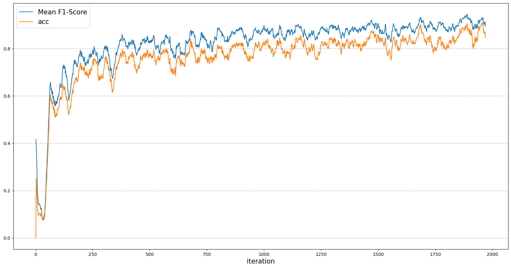

# Introduction
This repo is an unofficial implementation, with a single GPU restriction, of [<*An annotation-free whole-slide training approach to pathological classification of lung cancer types by deep learning*>](https://www.nature.com/articles/s41467-021-21467-y)
  
Visit https://github.com/aetherAI/whole-slide-cnn to see the original implementation. 


# Requirements
matplotlib==3.6.2  
numpy==1.23.5  
pandas==1.4.2  
Pillow==9.2.0  
python==3.9.0  
scikit-learn==1.0.2  
timm==0.6.12  
torch==1.13.0+cu116  
torchvision==0.14.0  
tqdm==4.64.1  
yacs==0.1.8  


# Usage

```bash
python main.py your/config/path.py
```

For example,
```bash
python main.py configs/leaf_224_train.py
```
"configs/leaf_224_train.py" is for [Plant Pathology 2021 - FGVC8](https://www.kaggle.com/competitions/plant-pathology-2021-fgvc8/data) Dataset


# Implementation Scheme


# Experiments

Dataset : [Plant Pathology 2021 - FGVC8](https://www.kaggle.com/competitions/plant-pathology-2021-fgvc8/data)  
Epoch : 1 (with 15833 imgs for train and 2799 imgs for valid)  
The time taken : 20h (with GeForce RTX 2070 SUPER)  
Learning curves (train) :



validation accuracy : 0.836  
validation mean f1score : 0.901  
  
private score : 0.79438 (late submission on Plant Pathology 2021 - FGVC8 kaggle competition)


# Considerations

Batch normalization shouldn't be used because the extractor is updated via gradient accumulation. As a result, I opted for NFNet over ResNet for the extractor.

But the following could be considered:  
* Batch normalization with low momentum  
* Other normalizations e.g. layer normalization
